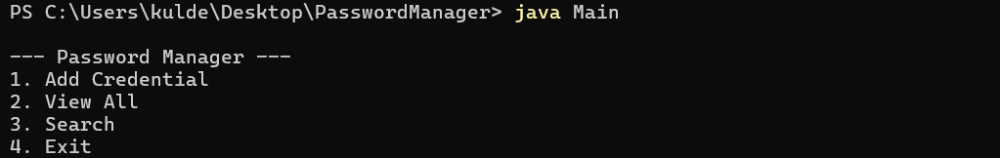
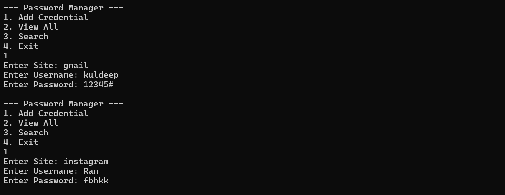

#  Password Manager (Java CLI Project)

##  Project Description
This project is a command-line based Password Manager developed in Java. It allows users to securely store, retrieve, and manage credentials (website, username, and password). Passwords are stored in encrypted form using a basic encryption technique.

---

##  Problem Statement
Managing multiple passwords manually is difficult and insecure. Users often reuse passwords or store them in unsafe locations. This project provides a simple and secure way to store credentials locally.

---

##  Features
- Add new credentials (site, username, password)
- Store passwords in encrypted format
- View all saved credentials (with decryption)
- Search credentials by website
- Persistent storage using file handling

---

##  Technologies Used
- Java (JDK 8+)
- Object-Oriented Programming (OOP)
- File Handling
- Command Line Interface (CLI)

---

##  Security Concept
Passwords are encrypted using a simple Caesar Cipher technique:
- Encryption: Each character is shifted by +3
- Decryption: Each character is shifted by -3

---

##  How to Run

1. Compile the program: javac *.java
2. Run the program: java Main

---

## 📸 Screenshots

| Feature | Image |
|---------|-------|
| Main Menu |  |
| Add Credential |  |
| View Credentials |  |

---

##  Author
Kuldeep Parmar
